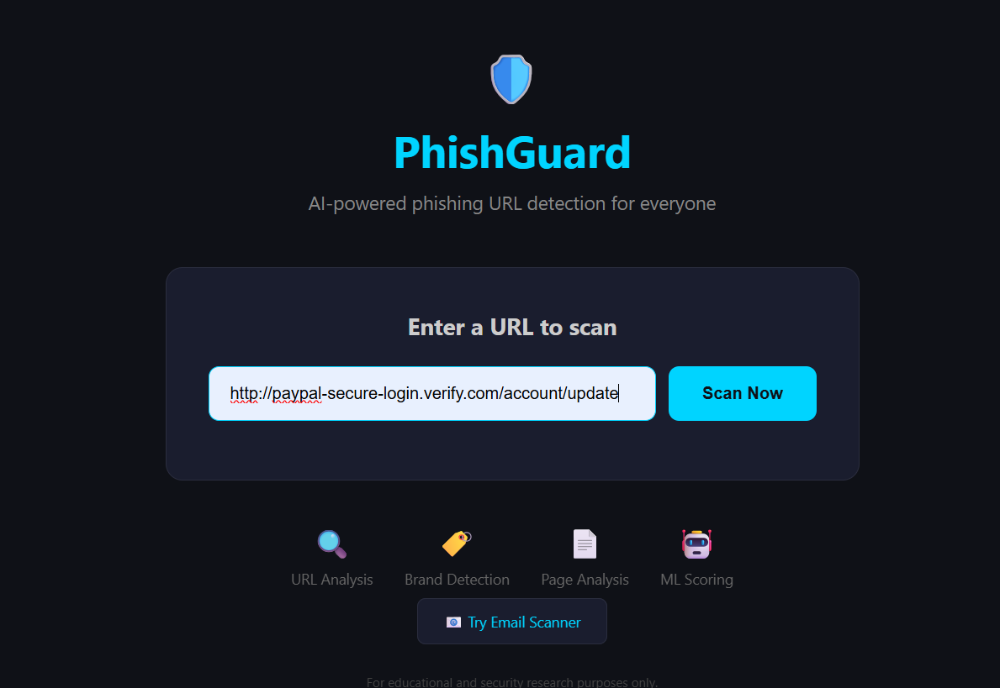
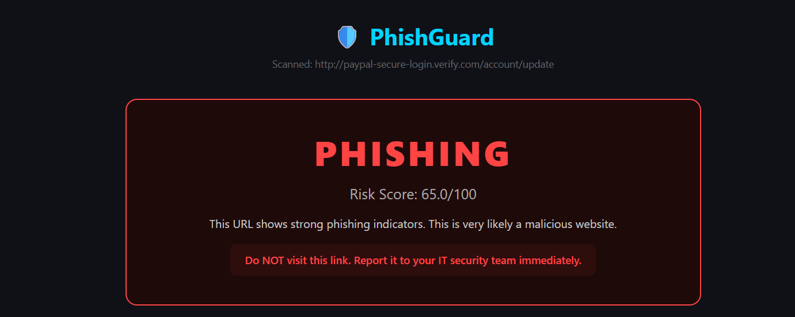
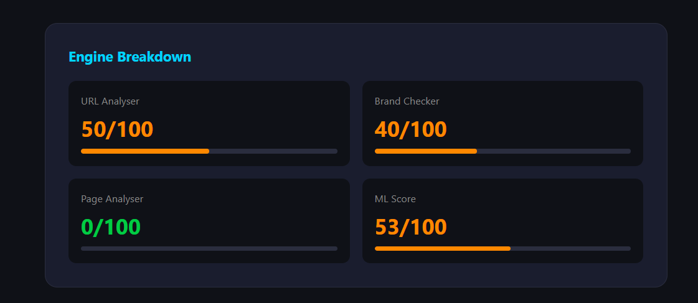
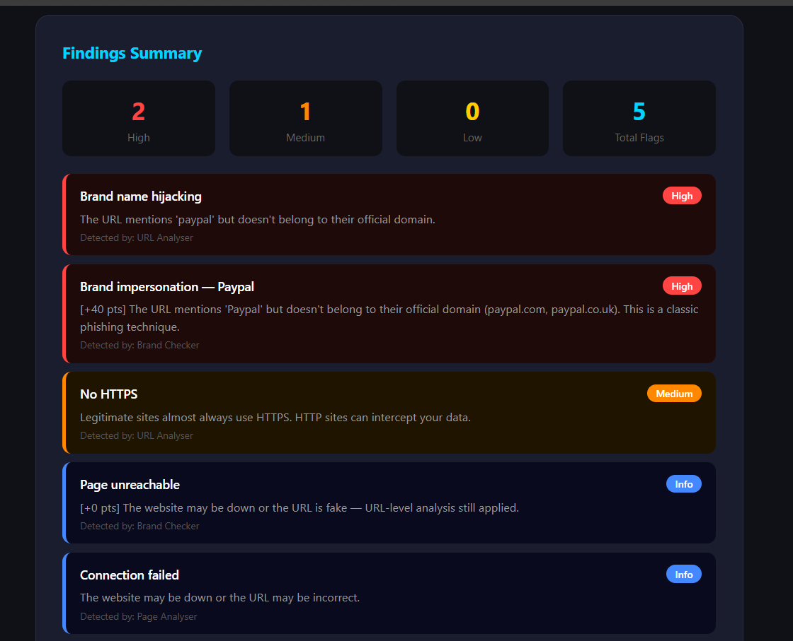
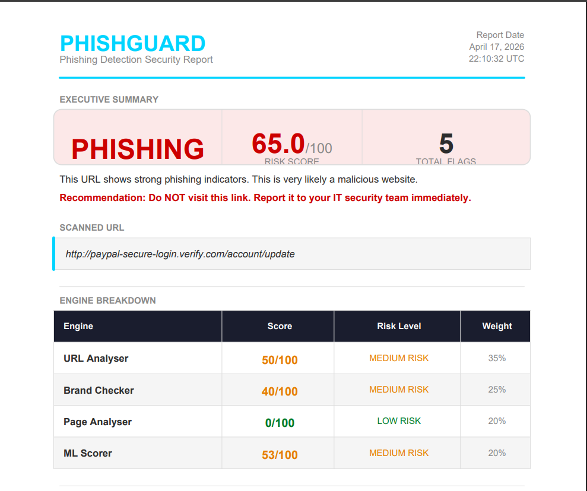
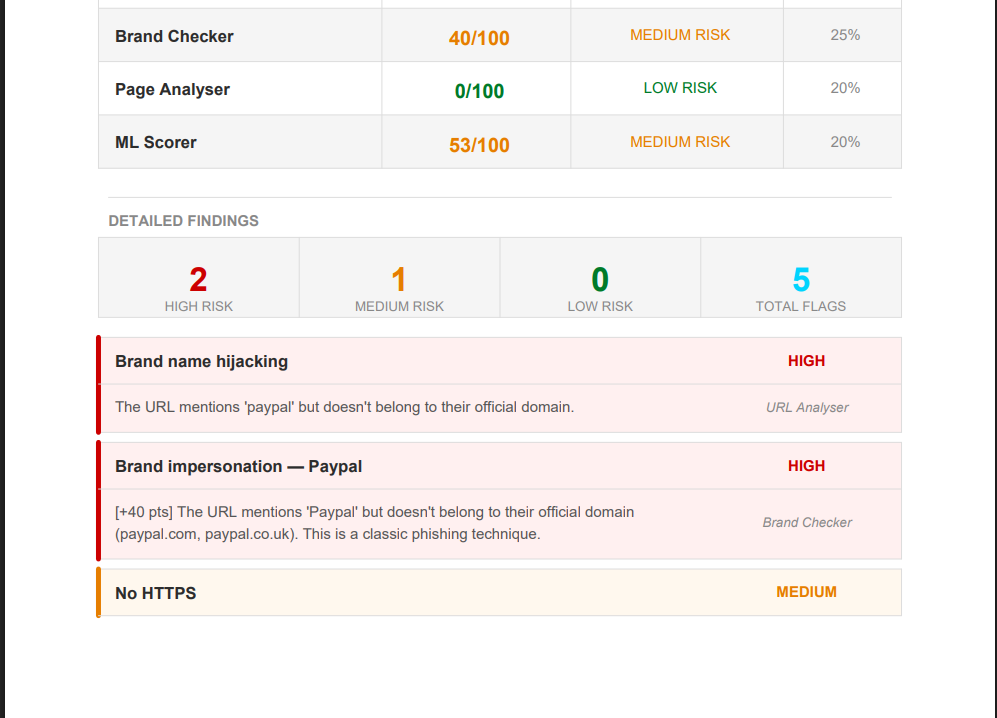
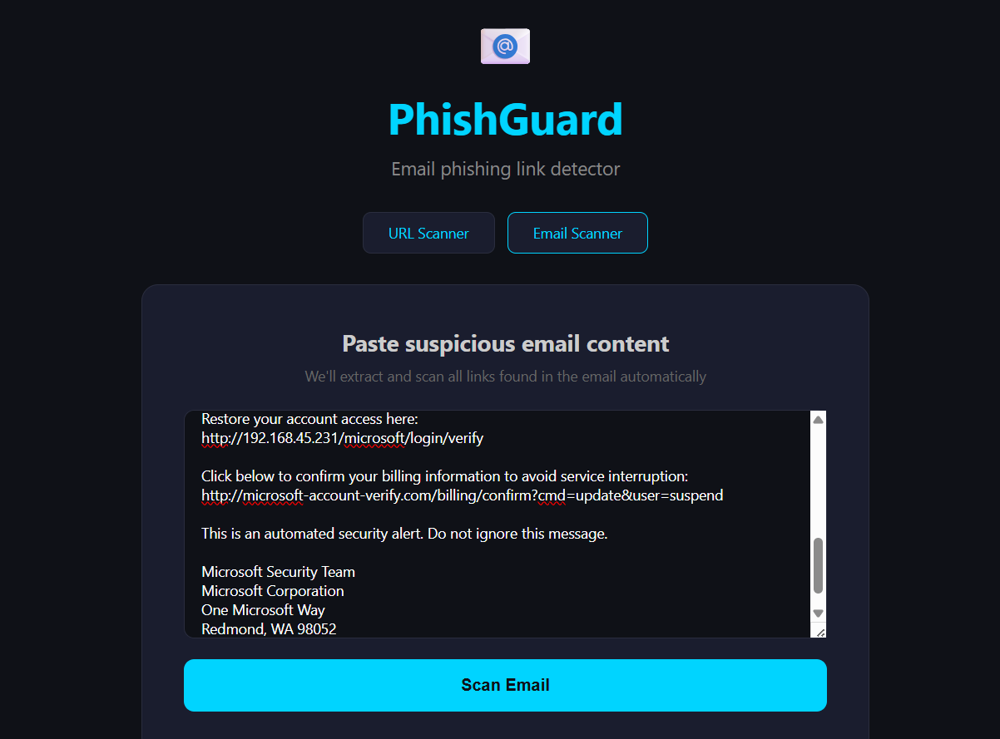
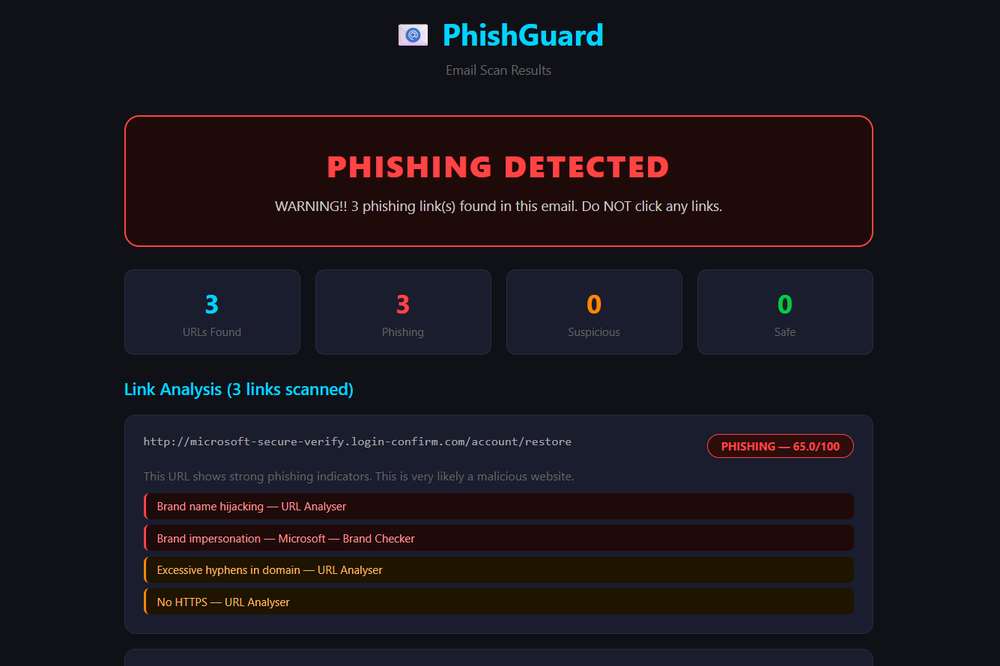
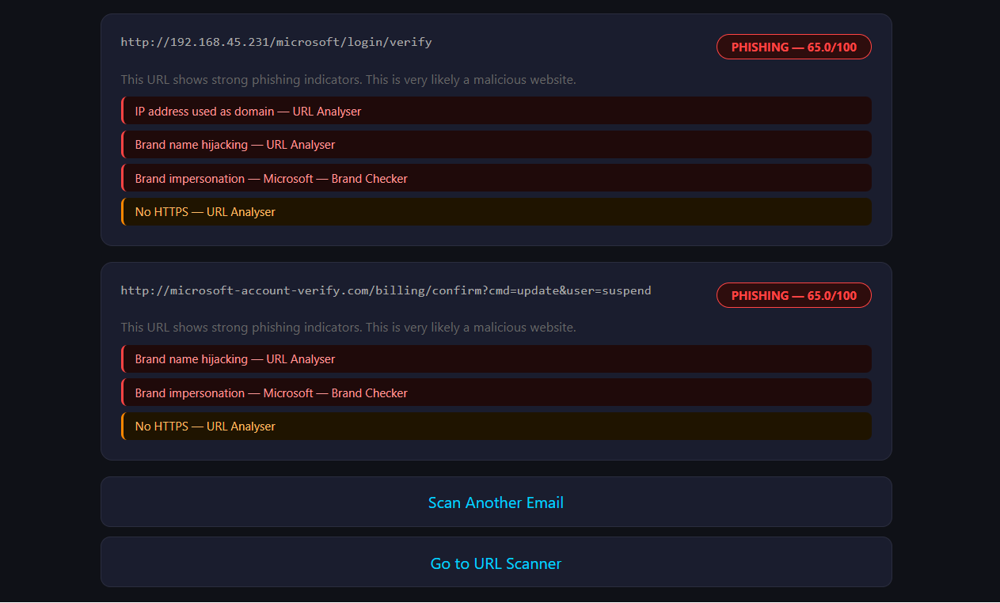

# 🛡️ PhishGuard — AI-Powered Phishing Detection Platform


> **PhishGuard** is a multi-engine phishing detection platform that analyses URLs and emails using layered security intelligence — combining URL pattern analysis, brand impersonation detection, page content analysis, and ML-based risk scoring — to protect companies from phishing attacks.

---

## 📸 Screenshots

### 🏠 Home — URL Scanner


### 🔴 Phishing Verdict


### 📊 Engine Breakdown


### 🔍 Detailed Findings with Proof


### 📄 Professional PDF Report



### 📧 Email Scanner


### ⚠️ Email — Phishing Detected




## 🚀 Features

### 🔍 Multi-Engine Detection System
PhishGuard runs **4 detection engines in parallel** using threading for maximum speed:

| Engine | What It Detects | Weight |
|---|---|---|
| **URL Analyser** | Suspicious patterns, IP addresses, hyphens, subdomains, @ symbols | 35% |
| **Brand Checker** | Brand impersonation, typosquatting, fake domain detection | 25% |
| **Page Analyser** | Fake login forms, urgency language, external form submissions | 20% |
| **ML Scorer** | Rule-based ML risk scoring with explainable proof points | 20% |

### ⚖️ Intelligent Risk Scoring
- Weighted scoring system combining all 4 engines
- Smart overrides — if brand impersonation is detected, score is boosted automatically
- Three verdict levels: **SAFE** (0–20) | **SUSPICIOUS** (21–50) | **PHISHING** (51–100)
- Every finding includes a proof point: `[+40 pts] Brand impersonation detected`

### 📄 Professional PDF Report Generation
- Auto-generated professional security report after every scan
- Executive summary with verdict, risk score and total flags
- Engine breakdown table with weights and risk levels
- Detailed findings section with severity ratings (HIGH / MEDIUM / LOW)
- CONFIDENTIAL footer — ready to hand to a real security team

### 📧 Email Scanner
- Paste any suspicious email content
- Automatically extracts all URLs from the email body
- Scans each link through all 4 engines simultaneously
- Returns overall verdict: **PHISHING DETECTED** / SUSPICIOUS / SAFE
- Shows per-link analysis with individual findings

### 🔌 REST API
Companies can integrate PhishGuard directly into their own systems:

```bash
# Scan a URL
POST /api/scan
Content-Type: application/json
{ "url": "https://suspicious-link.com" }

# Scan email content
POST /api/email/scan
Content-Type: application/json
{ "email_content": "Dear customer, verify here: http://..." }

# Health check
GET /api/health
```

**Example API response:**
```json
{
  "url": "http://paypal-secure-login.verify.com/account/update",
  "verdict": "PHISHING",
  "risk_score": 65.0,
  "engine_scores": {
    "url_analyser": 50,
    "brand_checker": 40,
    "page_analyser": 0,
    "ml_scorer": 53
  },
  "findings": [
    {
      "check": "Brand impersonation — Paypal",
      "severity": "High",
      "explanation": "[+40 pts] The URL mentions 'Paypal' but doesn't belong to their official domain.",
      "engine": "Brand Checker"
    }
  ]
}
```

### ⚡ Performance
- All 4 engines run in **parallel using ThreadPoolExecutor**
- Scan history tracks last 5 scans on the home page
- Loading spinner with real-time status messages during scan

---

## 🛠️ Tech Stack

| Component | Technology |
|---|---|
| Backend | Python, Flask |
| Detection Engines | Custom Python modules |
| ML Scoring | Rule-based ML with feature extraction |
| HTML Parsing | BeautifulSoup4 |
| HTTP Requests | Requests, HTTPX |
| PDF Generation | ReportLab |
| Threading | concurrent.futures |
| Frontend | HTML, CSS (dark theme) |

---

## 📁 Project Structure

```
PhishGuard/
├── modules/
│   ├── url_analyser.py       # URL pattern analysis engine
│   ├── brand_checker.py      # Brand impersonation detection
│   ├── page_analyser.py      # Page content analysis
│   ├── ml_scorer.py          # ML-based risk scoring
│   ├── risk_aggregator.py    # Combines all engine scores
│   └── email_scanner.py      # Email URL extraction & scanning
├── templates/
│   ├── index.html            # URL scanner home page
│   ├── result.html           # Scan results dashboard
│   ├── email.html            # Email scanner page
│   └── email_result.html     # Email scan results
├── reports/                  # Generated PDF reports
├── app.py                    # Flask application & API routes
├── report_generator.py       # PDF report generation
├── config.py                 # Configuration & brand profiles
└── requirements.txt
```

---

## ⚙️ Installation & Setup

### Prerequisites
- Python 3.10+
- pip

### Steps

```bash
# 1. Clone the repository
git clone https://github.com/Ashmitha-2006/PhishGuard.git
cd PhishGuard

# 2. Create virtual environment
python -m venv venv

# Windows
venv\Scripts\activate

# Linux/Mac
source venv/bin/activate

# 3. Install dependencies
pip install -r requirements.txt

# 4. Run the application
python app.py
```

Open your browser and go to `http://127.0.0.1:5000`

---

## 🧪 Testing

### Test URLs

| URL | Expected Verdict |
|---|---|
| `https://www.google.com` | ✅ SAFE |
| `http://paypal-secure-login.verify.com/account/update` | 🔴 PHISHING |
| `http://192.168.1.1/login` | 🔴 PHISHING |
| `http://microsoft-secure-verify.login-confirm.com` | 🔴 PHISHING |

### Test via API

```bash
curl -X POST http://127.0.0.1:5000/api/scan \
  -H "Content-Type: application/json" \
  -d '{"url": "http://paypal-secure-login.verify.com/account/update"}'
```

---

## 🔍 Detection Capabilities

### URL Analysis
- IP address used as domain (`+35 pts`)
- Excessively long URLs (`+10–20 pts`)
- Excessive hyphens in domain (`+8–15 pts`)
- Too many subdomains (`+10–20 pts`)
- No HTTPS (`+20 pts`)
- @ symbol in URL (`+30 pts`)
- Phishing keywords in URL (`+8–25 pts`)

### Brand Impersonation
- Brand keyword in URL but wrong domain (`+40 pts`)
- Typosquatting detection — `paypa1`, `g00gle`, `microsoift` (`+50 pts`)
- Multiple brand names in one URL (`+35 pts`)
- Page title brand mismatch (`+45 pts`)
- Urgency language detection (`+20–40 pts`)
- Stolen brand logo detection (`+30 pts`)

### Page Analysis
- Password field on suspicious domain (`+20 pts`)
- Form submitting to external domain (`+50 pts`)
- Suspicious keywords — "verify", "urgent", "suspended" (`+20 pts`)
- Very sparse page content (`+10 pts`)
- Right-click or keyboard disabled (`+25 pts`)
- Meta refresh auto-redirect (`+35 pts`)

---

## 📊 Scoring System

```
Final Score = (URL Score × 35%) + (Brand Score × 25%) + 
              (Page Score × 20%) + (ML Score × 20%)

Smart Overrides:
  → Brand impersonation detected    → score boosted to minimum 65
  → URL + ML both flag suspicious   → score boosted to minimum 55
  → Form submits externally         → score boosted to minimum 80

Risk Classification:
  0  – 20  →  SAFE        🟢
  21 – 50  →  SUSPICIOUS  🟡
  51 – 100 →  PHISHING    🔴
```

---

## 🔌 API Reference

### POST /api/scan
Scan a single URL for phishing indicators.

**Request:**
```json
{ "url": "https://example.com" }
```

**Response:**
```json
{
  "url": "string",
  "verdict": "SAFE | SUSPICIOUS | PHISHING",
  "risk_score": 0-100,
  "summary": "string",
  "recommendation": "string",
  "engine_scores": { ... },
  "findings": [ ... ],
  "stats": { "high": 0, "medium": 0, "low": 0, "total": 0 }
}
```

### POST /api/email/scan
Scan email content for phishing links.

**Request:**
```json
{ "email_content": "paste full email here" }
```

### GET /api/health
Returns tool status and available endpoints.

---

## 🎯 Real-World Use Cases

- **Security Teams** — Quickly assess suspicious URLs before employees click them
- **IT Departments** — Integrate the API into email filtering systems
- **Incident Response** — Generate professional PDF reports for security incidents
- **Security Awareness** — Demonstrate phishing tactics to educate employees
- **Penetration Testers** — Assess brand impersonation and phishing infrastructure

---

## 📄 PDF Report Sample

Every scan automatically generates a professional PDF security report including:
- Executive summary with verdict and risk score
- Engine breakdown with weighted scores
- Detailed findings with severity ratings and proof points
- Recommendations for remediation
- CONFIDENTIAL footer for professional use

---

## ⚠️ Disclaimer

PhishGuard is developed for **educational and cybersecurity research purposes only**.

This tool should only be used on URLs and emails where you have permission to perform security analysis. The developer is not responsible for any misuse of this tool.

---

## 👩‍💻 Author

**Ashmitha** — Cybersecurity Student & Security Tool Developer

[](https://github.com/Ashmitha-2006)

---

## 🔗 Related Projects

- [Web Vulnerability Scanner](https://github.com/Ashmitha-2006/web_vuln_scanner) — Python-based web vulnerability scanner detecting XSS, SQL injection, security headers and more

---

*Built with Python, Flask and a passion for cybersecurity* 🛡️
